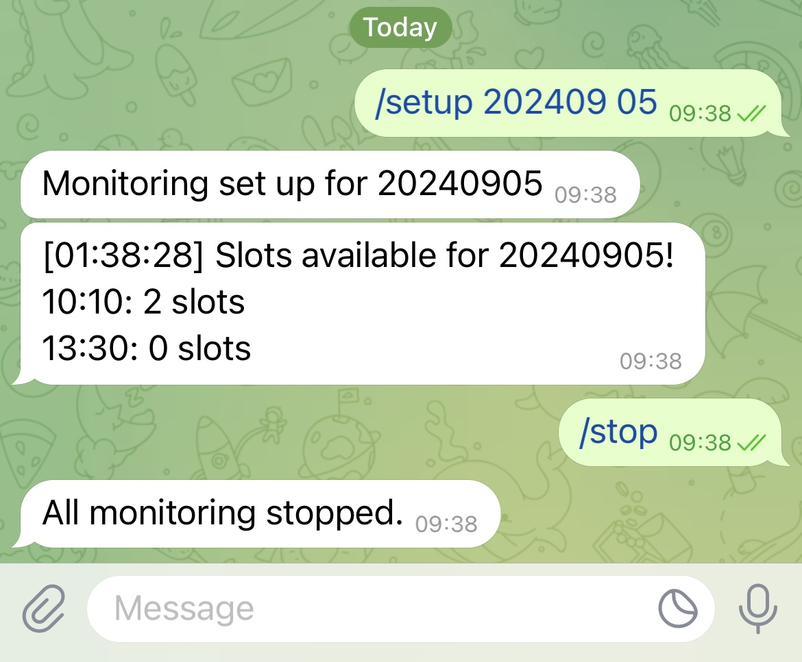

# Tokyo Imperial Palace Monitor

This tool can be used to monitor the availability of reservations to [The Imperial Palace in Tokyo](https://sankan.kunaicho.go.jp/register/month/1001). It can work with Telegram Bot to interact with users.

<p align="center">
  
</p>

## Getting Started

- Install required packages
    ```bash
    $ pip3 install -r requirements.txt
    ```

- Configure `BOT_TOKEN` and `UPDATE_INTERVAL` in `main.py`.

- Run the script

    ```bash
    $ python3 main.py
    ```

- To exit, press `Ctrl+C`.

## Using `tmux` to Keep Processes Running

We will use `tmux` to run the program so that it will continue running after the ssh session disconnects. Learn more about other [approaches](https://unix.stackexchange.com/questions/479/keep-processes-running-after-ssh-session-disconnects) and a beginner [guide](https://www.hamvocke.com/blog/a-quick-and-easy-guide-to-tmux/) to `tmux`.

- Start `tmux` with a new session

  ```bash
  $ ssh azure
  $ tmux
  ```

- Run the program in the session

  ```bash
  $ python3 main.py
  ```

- Detach from the session by pressing `C-b d`, which means press `Ctrl+b`, release, and then press `d`. You will get the output

  ```
  [detached (from session 0)]
  ```

- Disconnect ssh as you want

  ```bash
  $ exit
  ```

- After reconnecting to ssh, attach to `tmux` session

  ```bash
  $ ssh azure
  $ tmux attach
  ```

  The program should still be running properly.

## Resources

- [Beautiful Soup](https://www.crummy.com/software/BeautifulSoup/bs4/doc/#installing-beautiful-soup)
- [tmux cheatsheet](https://gist.github.com/andreyvit/2921703)
- [Python Telegram Bot](https://python-telegram-bot.org/)
